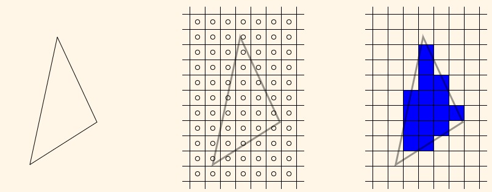
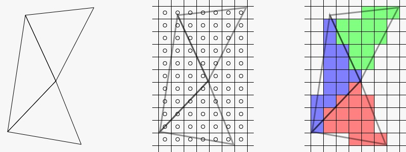

# **Basic Introduction to OpenGL and Graphic Rendering**

In this project I will be Learning ***Modern 3D Graphics Programming by***. Everything writen in this repository will be for personal study.

# Graphics and Rendering
Every that is rendered in a screen comes from a 2D array of ***pixels***. The word pixel comes from the term **Pic**ture **El**ement.


Every square present in this image can be seen as a pixel with its own set of coordinates.

But what if we want to print a 3D world to the screen? Well this is where it gets more complex. This proccess of converting a #d world to a 2D image to print to the screen is called ***rendering***. The actual proccess of for rendering in real-time is ***rasterization***, and a rendering system that uses rasterization is called ***rasterizer***.

Rasterization works by treating the object as a mesh of polygons. A ***mesh*** is a series of of adjacent triangles that define the outer surface of the object. The terms ***geometry***, ***model*** or ***mesh*** are used interchangeably.

## **Trieangles and vertices**
A triangle consist of 3 vertices. A ***vertex*** is a collection of information or data. Each vertex can contain a lot of information (position, color, etc), but it must at least contain the position of the vertex. This data consist of 3 three-dimentional points. It is commonly represented by (X, Y, Z). 

# **Rasterization Overview**
This overview is a very simplified version of the rasterization pipeline.

## **Clip Space Transformation**
This first step of rasterization is transforming the vertices of a triangle to a certain region of space. Everything in this volume or space will be rendered to the output image and everything not in the volume wont be rendered to the image.

Compared to positions in 3D space, that have 3 coordinates, a clip space has ***4 coordinates***. In this system, the direction of X is to the right, Y is up, Z is away from the viewer and W defines what extent of clip space are for the vertex.

## **Normalized Coordinates**
To transform from Clip Space Coordinates to Normalized Coordinates you need to take the X, Y and Z of each vertex position and divide them by the W. This makes the range of X, Y and Z between [-1, 1].

### **Noemalized Coordinate Space**


The cube indicated de boundaries of the normalized device coordinates sapce.

## **Window Transformation**
In this step we transform the Normalized Coordinates to Window coordinates, which are relative to the window. Even if we refer to them as window coordinates, they are still 3 dimentional coordinates. The only difference is that the bounds for these coordinates depends on the viewable window.

> Its good to note that window coordinates have the bottom-left corner of the screen as the (0, 0).

## **Scan Conversion**
This process takes the triangle and breaks it up based on the pixels of the window.



In the grid, each circle represents the center of the pixel. This represents a ***sample***. In this step, the triangle will produce a ***fragment*** for every pixel sample within the area of the triangle. For triangles that perfectly share an edge, OpenGL guarantees no gaps between them.

### **Shared Edge Scan Conversion**


## **Fragment Processing**
In this step, the rasterizer takes the fragment and transforms it into one or more color values. All the fragments from a triangle need to be processed before starting with the fragments rfom another triangle. This is because, the fragments from one triangle can overlap the fragments from another.

## **Colors**
Colors in computer graphics are a series of numbers on the range [0, 1]. This range corresponds to an intensity of the particular color. 

The set of reference colors is called a ***colorspace***. There are many color spaces, but the most common, and the one that I will be using is RGB (Red, Green, Blue).

## **Shaders**
A ***shader*** is a program designed to be run on a renderer as part of the rendering operation. Shader can only be excecuted at certain points of the rendering process. These shader stages are hooks where the user can add arbitrary algorithms to create custom and specific visual effects depending on the circunstances.

## **Introduction to OpenGL**
***OpenGL API*** is defined as a state machine where almost all functions set or retrive some state from the API. Functions that do not change the state are functions that use the currently set state to cause rendering to happen.

In C++, if we want to create an object containing an int, float and a string, we would create it and access it like this:

```
struct Object
{
    int num;
    float fnum;
    char *string;
};

Object object;

object.num = 1;
object.fnum = 1.0f;
object.string = "Hello";
```

In OpenGL, we would code it like this:
```
GLuint object;
glGenObject(1, &object);

glBindObject(GL_MODIFY, object);
glObjectParameteri(GL_MODIFY, GL_OBJECT_COUNT, 1);
glObjectParameteri(GL_MODIFY, GL_OBJECT_OPACITY, 1.0f);
glObjectParameteri(GL_MODIFY, GL_OBJECT_NAME, "Hello");
```

> Its good to note that none of these are actual OpenGL commands, they are just examples.

Since OpenGL owns all the storage for all objects, the user can only access an object by reference. Almos all objects are referred to by an unsigned int (GLuint).

To actually modify an object, we need to bind it to the OpenGL context. Objects can be bound to different locations of the context. With this, the same object can be used in different ways. These locations are called ***targets***. Objects can have a list of different targets or just one. In the fictional OpenGL code above, ***GL_MODIFY*** is the location or target where the object is bound. Binding the object to 0 is the same as unbinding the object.