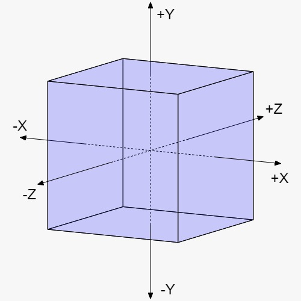

# **Basic OpenGL and Graphic Rendering**

In this project I will be following ***Learning Modern 3D Graphics Programming by*** *Jason L. McKesson*. 

# Graphics and Rendering
Every that is rendered in a screen comes from a 2D array of ***pixels***. The word pixel comes from the term **Pic**ture **El**ement.

Every square present in this image can be seen as a pixel with its own set of coordinates.

But what if we want to print a 3D world to the screen? Well this is where it gets more complex. This proccess of converting a #d world to a 2D image to print to the screen is called ***rendering***. The actual proccess of for rendering in real-time is ***rasterization***, and a rendering system that uses rasterization is called ***rasterizer***.

Rasterization works by treating the object as a mesh of polygons. A ***mesh*** is a series of of adjacent triangles that define the outer surface of the object. The terms ***geometry***, ***model*** or ***mesh*** are used interchangeably.

## **Trieangles and vertices**
A triangle consist of 3 vertices. A ***vertex*** is a collection of information or data. Each vertex can contain a lot of information (position, color, etc), but it must at least contain the position of the vertex. This data consist of 3 three-dimentional points. It is commonly represented by (X, Y, Z). 

# **Rasterization Overview**
This overview is a very simplified version of the rasterization pipeline.

## **Clip Space Transformation**
This first step of rasterization is transforming the vertices of a triangle to a certain region of space. Everything in this volume or space will be rendered to the output image and everything not in the volume wont be rendered to the image.

Compared to positions in 3D space, that have 3 coordinates, a clip space has ***4 coordinates***. In this system, the direction of X is to the right, Y is up, Z is away from the viewer and W defines what extent of clip space are for the vertex.

## **Normalized Coordinates**
To transform from Clip Space Coordinates to Normalized Coordinates you need to take the X, Y and Z of each vertex position and divide them by the W. This makes the range of X, Y and Z between [-1, 1].

### **Noemalized Coordinate Space**

The cube indicated de boundaries of the normalized device coordinates sapce.

## **Window Transformation**
In this step we transform the Normalized Coordinates to Window coordinates, which are relative to the window. Even if we refer to them as window coordinates, they are still 3 dimentional coordinates.